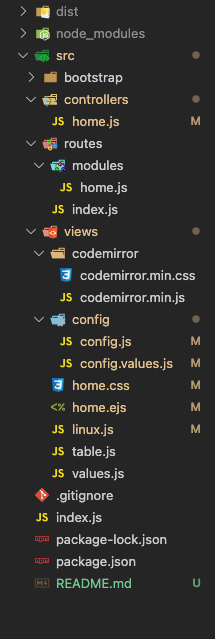
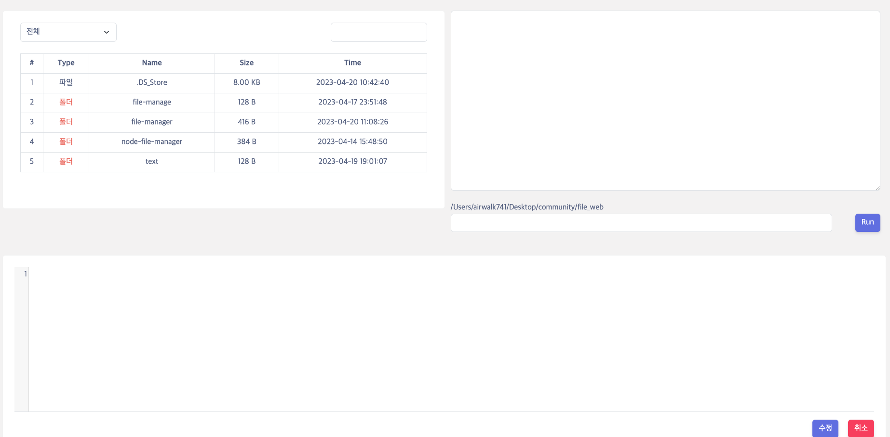
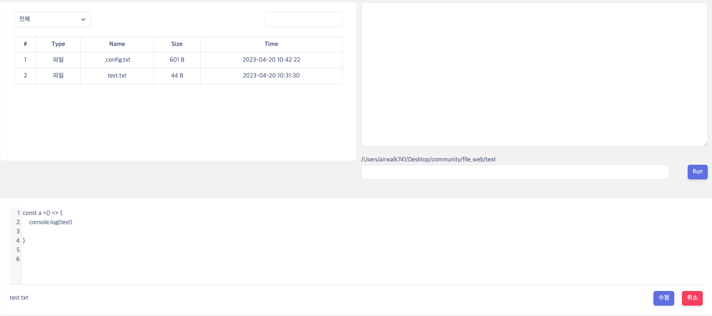
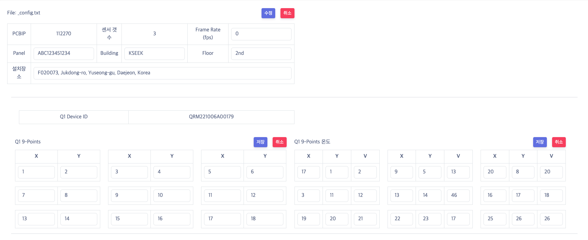

# File Manager 

>node: v16.19.0
>
>npm: v8.19.3
>
>node Express + ejs + css


## 목차

#### 1. 서버 실행 방법 및 빌드 파일 생성

#### 2. 폴더 구조

#### 3. 동작 설명?


## 1. 서버 실행 방법 및 빌드 파일 생성


#### 서버 실행

- `module` 설치

```bash
npm i
```

- 서버 실행 

```bash
npm run serve
```

- 포트 변경 원할 시 `index.js` 에서 `port` 번호 바꿔주면 됩니다.


#### 빌드 파일 생성

- 아래 명령어 실행 시 `dist` 폴더에 빌드파일 생성됩니다.

```bash
npm run build
```


- 생성된 빌드 파일 포트 변경하여 실행하고 싶으시면 옵션을 주면 됩니다.

```bash
./file-manager -p [포트번호]
```


- `package.json` 의 `targets`에서  원하는 OS에 맞게 작성 후 빌드 하셔도 됩니다.

```json
  "pkg": {
    "scripts": "*.js",
    "targets": [
      "node14-macos-arm64",
      "node14-macos-x64",
      "node14-linux-arm64",
      "node14-linux-x64",
      "node14-windows-arm64",
      "node14-windows-x64"
    ],
    "assets": [
      "src/**/*"
    ]
  },
```


## 폴더 구조



- `src/bootstrap` : bootstrap 라이브러리 관련 파일

- `src/controller` : 라우팅 정보에 의한 api 동작 함수들의 모음

- `routes` : 라우팅 정보들의 모음
- `views`:  화면 template 관련 모음
  - `codemirror` :  codemirror 라이브러리 관련 파일  [데모](https://codemirror.net/5/demo/theme.html)
  - `config`
    - `config.js` : `_config.txt` 파일 관련 함수 모음 (파싱, 수정 함수)
    - `config.values.js` : `_config.txt ` 파일 관련 DOM Element 모음
  - `home.css`  : html css 관련
  - `home.ejs` : ejs template
  - `linux.js` : 리눅스 명령어 처리 관련
  - `table.js` : 왼쪽 상단 테이블,   파일 읽기, 수정 함수 (`_config.txt` 제외)
  - `values.js` : 리눅스, 테이블 관련 DOM Element 모음


## 3. 동작 설명


### 1. 파일 이동




- 리눅스 명령어 `input` 창에서 `cd` 명령어로 이동 가능
  - `cd ..` : 상위 디렉토리 이동
- 폴더 `Name` 클릭시 해당 폴더로 이동가능


### 2. 파일 읽기 및 수정

- 파일 읽기는 `_config.txt` 형식이 맞으면 메일로 보내주신 UI가 나타나고 형식이 맞지 않으면 row Text가 출력 됩니다.


1. 형식이 맞지 않을 때 (여기서 형식이란 이메일로 보내주는 text 형식입니다.)

- `1:PCBIP112270:S2:Q1QRM221006A00179/Q1PT/15,10;30,10;45,10;15,25;30,25;45,25;15,40;30,40;45,40/Q1TV/60,50,49;60,50,49;60,50,49;60,50,49;60,50,49;60,50,49;60,50,49;60,50,49;60,50,49:Q2QRM221006A00179/Q2PT/15,10;30,10;45,10;15,25;30,25;45,25;15,40;30,40;45,40/Q2TV/60,50,49;60,50,49;60,50,49;60,50,49;60,50,49;60,50,49;60,50,49;60,50,49;60,50,49:F0100:73, Jukdong-ro, Yuseong-gu, Daejeon, Korea  ;Building,KSEEK;Floor,2nd;Panel,ABC123451234`



- 아래 수정 폼에 수정할 텍스트를 작성하고 수정 버튼 클릭 시 수정이 완료됩니다. 


2. `_config.txt` 형식이 맞았을 때




- UI만 변경 됐을 뿐 마찬가지로 수정할 텍스트 입력 후 저장 버튼 누르면 됩니다.
- 취소 버튼 클릭시 해당 폼의 원래 값(원본 값)으로 돌아갑니다.


